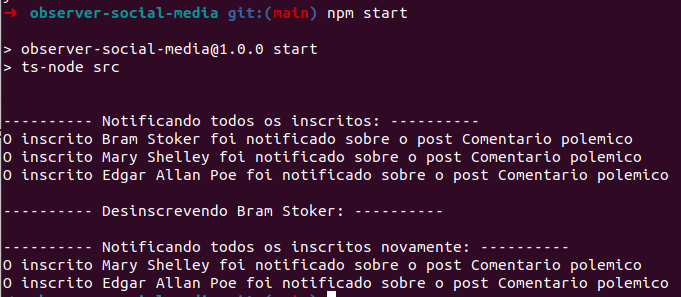
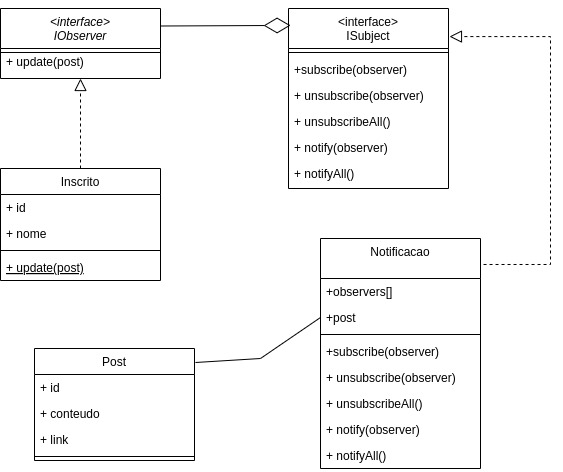

# observer-social-media

Este projeto é um exemplo prático do Observer Pattern.

Neste exemplo, existem duas classes importantes:

- O Inscrito é a implementação de um Observer.
- A Notificação é a implementação de um Subject.

No `index.ts`, há a interação entre as duas classes. Use o comando `npm start` para executar o projeto.

## Diagrama de Classes:

